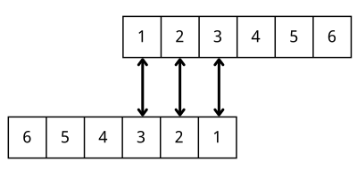

# Convolutional Neural Networks (CNN)

## Convolutions
!!! df "**Definition** (Convolutions)"
    In mathematics, the _convolution_ between two functions $f,g: \mathbb{R}^d \rightarrow \mathbb{R}$ is defined as 

    $$\begin{align*}
    (f * g)(x) = \int f(t)g(x-t)dt
    \end{align*}$$

    We measure the overlap between $f$ and $g$ when one function is "flipped" and shifted by $x$.

!!! eg "**Example** (Dice - Not a Good Example)"
    Assume there are two 6-face dices. We want to know the probability of the sum of two dices equals to 4. <br>
    Define $f(x) = \text{probability of getting x on dice 1}$, $g(x) = \text{probability of getting x on dice 2}$. The probability of getting a sum of 4 is:
    
    $$\begin{align*}
    (f * g)(4) = \sum^3_{m=1}f(4-m)g(m) = f(1)g(3) + f(2)g(2) + f(3)g(1)
    \end{align*}$$

    We can view this as first flipped the function $g$, and then shift $1,2,3,4$ position and calculate the overlapping area.

    <figure markdown="span">
    { width="400" }
    </figure>

!!! im "**Important Note** (Convolutions are Impact Sum)"
    
## Architecture Overview
!!! im "**Important Note** (Layers in ConvNets)"
    We use three main types of layers to build ConvNet architectures: Convolutional Layer, Pooling Layer, and Fully-Connected Layer. We will stack these layers to form a full ConvNet architecture.

!!! eg "**Example** (ConvNet Architecture for CIFAR-10 Classification)"
    - **INPUT Layer** [32x32x3] will hold the raw pixel values of the image, in this case an image of width 32, height 32, and with three color channels R,G,B.
    - **CONV Layer** will compute the output of neurons that are connected to local regions in the input, each computing a dot product between their weights and a small region they are connected to in the input volume. This may result in volume such as [32x32x12] if we decided to use 12 filters.
    - **RELU Layer** will apply an elementwise activation function, such as the $\max(0,x)$ thresholding at zero. This leaves the size of the volume unchanged ([32x32x12]).
    - **POOL Layer** will perform a downsampling operation along the spatial dimensions (width, height), resulting in volume such as [16x16x12].
    - **FC Layer** (i.e. fully-connected) will compute the class scores, resulting in volume of size [1x1x10], where each of the 10 numbers correspond to a class score, such as among the 10 categories of CIFAR-10.

    <figure markdown="span">
    { width="600" }
    <figcaption>Activations of an ConvNet Architecture</figcaption>
    </figure>

## Convolutional Layer
!!! df "**Definition** (Filter - Receptive Fields)"
    The _Filter_, or the Receptive Field, in the context of CNN, is a $F \times F \times 3$ square with which we use to multiply local regions in the image. 

!!! im "**Important Note** (Intuition about Filters)"
    Each filter is looking for a specific feature in the picture.

!!! df "**Definition** (Stride)"
    _Stride_ is the number of the pixel jumped when the filters slide. When the stride is 1 then we move the filters one pixel at a time. When the stride is 2 (or uncommonly 3 or more, though this is rare in practice) then the filters jump 2 pixels at a time as we slide them around. This will produce smaller output volumes spatially.

!!! im "**Important Note** (Why Stride 1)"
    Why use stride of 1 in CONV? Smaller strides work better in practice. Additionally, as already mentioned stride 1 allows us to leave all spatial down-sampling to the POOL layers, with the CONV layers only transforming the input volume depth-wise.

!!! df "**Definition** (Zero-Padding)"
    The _zero-padding_ is a boarder around the input volume that only has element 0. Sometimes it will be convenient to pad the input volume with zeros around the border. The size of this zero-padding is a hyperparameter. The nice feature of zero padding is that it will allow us to control the spatial size of the output volumes

!!! im "**Important Note** (Why Padding?)"
    Why use padding? In addition to keeping the spatial sizes constant after CONV, doing this actually improves performance. If the CONV layers were to not zero-pad the inputs and only perform valid convolutions, then the size of the volumes would reduce by a small amount after each CONV, and the information at the borders would be “washed away” too quickly.

!!! im "**Important Note** (Computing Output volume)"
    The Conv Layer:

    - Accepts a volume of size \( W_1 \times H_1 \times D_1 \)
    - Requires four hyperparameters: <br>
       &nbsp;&nbsp;&nbsp;&nbsp;1. Number of filters \( K \), <br>
       &nbsp;&nbsp;&nbsp;&nbsp;2. their spatial extent \( F \), <br>
       &nbsp;&nbsp;&nbsp;&nbsp;3. the stride \( S \), <br>
       &nbsp;&nbsp;&nbsp;&nbsp;4. the amount of zero padding \( P \).
    - Produces a volume of size \( W_2 \times H_2 \times D_2 \) where: <br>
        &nbsp;&nbsp;&nbsp;&nbsp;\( W_2 = \left(\frac{W_1 - F + 2P}{S}\right) + 1 \) <br>
        &nbsp;&nbsp;&nbsp;&nbsp;\( H_2 = \left(\frac{H_1 - F + 2P}{S}\right) + 1 \) &nbsp; (i.e. width and height are computed equally by symmetry) <br>
        &nbsp;&nbsp;&nbsp;&nbsp;\( D_2 = K \)
    - With parameter sharing, it introduces \( F \cdot F \cdot D_1 \) weights per filter, for a total of \( (F \cdot F \cdot D_1) \cdot K \) weights and \( K \) biases.
    - In the output volume, the \( d \)-th depth slice (of size \( W_2 \times H_2 \)) is the result of performing a valid convolution of the \( d \)-th filter over the input volume with a stride of \( S \), and then offset by \( d \)-th bias.

    A common setting of the hyperparameters is \( F = 3 \), \( S = 1 \), \( P = 1 \).

!!! im "**Important Note** (Convolution Demo)"
    Below is a running demo of a CONV layer. The input volume is of size \( W_1 = 5 \), \( H_1 = 5 \), \( D_1 = 3 \), and the CONV layer parameters are \( K = 2 \), \( F = 3 \), \( S = 2 \), \( P = 1 \). Therefore, the output volume size has spatial size \( (5 - 3 + 2)/2 + 1 = 3 \). The visualization below iterates over the output activations (green), and shows that each element is computed by **elementwise multiplying the highlighted input (blue) with the filter (red), summing it up, and then offsetting the result by the bias**.<br><br>
    
    <div class="fig figcenter fighighlight">
    <iframe src="https://cs231n.github.io/assets/conv-demo/index.html" width="100%" height="700px;" style="border:none;"></iframe>
    <div class="figcaption"></div>
    </div>

!!! im "**Important Note** (Implementation as Matrix Multiplication)"
    A common implementation pattern of the CONV layer is to formulate the forward pass of a convolutional layer as one big matrix multiply as follows:<br><br>
    
    The local regions (blocks that have the same shape as the filter) in the input image are stretched out into columns in an operation commonly called **im2col**. For example, if the input is [227x227x3] and it is to be convolved with 11x11x3 filters at stride 4, then we would take blocks of shape [11x11x3] in the input and stretch each block into a column vector of size 11*11*3 = 363. Iterating this process in the input at stride of 4 gives $((227-11)/4+1)^2$ = 3025 blocks, leading to an output matrix $X_{col}$ of _im2col_ of size [363 x 3025].<br>
    <br>
    Remember that we are to multiply each column of $X_{col}$ with the weights of the CONV Layer. The weights of the CONV layer are similarly stretched out into rows. For example, if there are 96 filters of size [11x11x3] this would give a matrix $W_{row}$ of size [96 x 363].<br>
    <br>
    The result of a convolution is now equivalent to performing one large matrix multiply `np.dot(W_row, X_col)`. In our example, the output of this operation would be [96 x 3025], giving the output of the dot product of each filter at each location.<br>
    <br>
    The result must finally be reshaped back to its proper output dimension [55x55x96].<br>
    <br>
    The downside is that it can use a lot of memory, since some values in the input volume are replicated multiple times in $X_{col}$. The benefit is that there are many very efficient implementations of Matrix Multiplication that we can take advantage of (e.g. BLAS API). 

!!! nt "**Note** (1x1 Convolution)"
    As an aside, several papers use 1x1 convolutions, as first investigated by [<u>Network in Network</u>](http://arxiv.org/abs/1312.4400).

!!! im "**Important Note** (Implementing Convolution Layer)"

    ``` py linenums="1"
    def conv_forward_naive(x, w, b, conv_param):
        """A naive implementation of the forward pass for a convolutional layer.

        The input consists of N data points, each with C channels, height H and
        width W. We convolve each input with F different filters, where each filter
        spans all C channels and has height HH and width WW.

        Input:
        - x: Input data of shape (N, C, H, W)
        - w: Filter weights of shape (F, C, HH, WW)
        - b: Biases, of shape (F,)
        - conv_param: A dictionary with the following keys:
        - 'stride': The number of pixels between adjacent receptive fields in the
            horizontal and vertical directions.
        - 'pad': The number of pixels that will be used to zero-pad the input.

        During padding, 'pad' zeros should be placed symmetrically (i.e equally on both sides)
        along the height and width axes of the input. Be careful not to modfiy the original
        input x directly.

        Returns a tuple of:
        - out: Output data, of shape (N, F, H', W') where H' and W' are given by
        H' = 1 + (H + 2 * pad - HH) / stride
        W' = 1 + (W + 2 * pad - WW) / stride
        - cache: (x, w, b, conv_param)
        """
        out = None
        
        N, C, H, W = x.shape
        F, _, HH, WW = w.shape
        stride, pad = conv_param['stride'], conv_param['pad']
        H_out = 1 + (H + 2 * pad - HH) // stride
        W_out = 1 + (W + 2 * pad - WW) // stride
        out = np.zeros((N, F, H_out, W_out))

        for image_index in range(N):
            image = x[image_index]

            # Create a new matrix with the padded dimensions
            padded_image = np.zeros((C, H + 2 * pad, W + 2 * pad))
            
            # Insert the original image into the padded matrix
            padded_image[:, pad:pad+H, pad:pad+W] = image

            _, padded_H, padded_W = padded_image.shape

            for filter_index in range(F):
                _filter = w[filter_index]
                for i in range(0, padded_H-HH+1, stride):
                    for j in range(0, padded_W-WW+1, stride):
                        # Extract the region of the padded image corresponding to the filter's location
                        region = padded_image[:, i:i+HH, j:j+WW]

                        # Perform element-wise multiplication and sum the result
                        out[image_index][filter_index][i//stride][j//stride] = np.sum(region * _filter) + b[filter_index]             

        cache = (x, w, b, conv_param)

        print(out)

        return out, cache

    def conv_backward_naive(dout, cache):
        """A naive implementation of the backward pass for a convolutional layer.

        Inputs:
        - dout: Upstream derivatives of shape (N, F, H_out, W_out).
        - cache: A tuple of (x, w, b, conv_param) as in conv_forward_naive

        Returns a tuple of:
        - dx: Gradient with respect to x, of shape (N, C, H, W)
        - dw: Gradient with respect to w, of shape (F, C, HH, WW)
        - db: Gradient with respect to b, of shape (F,)
        """
        x, w, b, conv_param = cache
        N, C, H, W = x.shape
        F, _, HH, WW = w.shape
        stride, pad = conv_param['stride'], conv_param['pad']
        H_out = 1 + (H + 2 * pad - HH) // stride
        W_out = 1 + (W + 2 * pad - WW) // stride

        # Initialize gradients
        dx = np.zeros_like(x)
        dw = np.zeros_like(w)
        db = np.zeros_like(b)

        # Pad the input x and dx
        padded_x = np.pad(x, ((0, 0), (0, 0), (pad, pad), (pad, pad)), mode='constant')
        padded_dx = np.zeros_like(padded_x)

        # Compute db
        db = np.sum(dout, axis=(0, 2, 3))

        # Compute dw and dx
        for image_index in range(N):
            image = padded_x[image_index]
            dimage = padded_dx[image_index]
            
            for filter_index in range(F):
                _filter = w[filter_index]
                dout_filter = dout[image_index, filter_index]
                
                for i in range(H_out):
                    for j in range(W_out):
                        # Calculate the current region
                        i_start = i * stride
                        j_start = j * stride
                        i_end = i_start + HH
                        j_end = j_start + WW

                        region = image[:, i_start:i_end, j_start:j_end]
                        
                        # Update the gradient for w (dw)
                        dw[filter_index] += region * dout_filter[i, j]
                        
                        # Update the gradient for x (dx)
                        dimage[:, i_start:i_end, j_start:j_end] += _filter * dout_filter[i, j]
            
            # Remove padding from the gradient for x
            dx[image_index] = dimage[:, pad:-pad, pad:-pad]

        return dx, dw, db
    ```

## Relu Layer
!!! im "**Important Note** (Implementing Relu Layer)"

    ``` cpp linenums="1"
    def relu_forward(x):
        """Computes the forward pass for a layer of rectified linear units (ReLUs).

        Input:
        - x: Inputs, of any shape

        Returns a tuple of:
        - out: Output, of the same shape as x
        - cache: x
        """
        out = None

        out = np.maximum(0, x)

        cache = x
        return out, cache


    def relu_backward(dout, cache):
        """Computes the backward pass for a layer of rectified linear units (ReLUs).

        Input:
        - dout: Upstream derivatives, of any shape
        - cache: Input x, of same shape as dout

        Returns:
        - dx: Gradient with respect to x
        """
        dx, x = None, cache

        dx = dout * (x > 0)

        return dx
    ```
    
    
    
## Pooling Layer
!!! df "**Definition** (Pooling Layer)"
    It is common to periodically insert a Pooling layer in-between successive Conv layers in a ConvNet architecture. The goal is: **To progressively reduce the spatial size of the representation, thus to reduce the amount of parameters and computation, and hence to control overfitting**. We use **MAX** operation to achieve these goals.<br>
    <br>
    The most common form is a pooling layer with filters of size 2x2 applied with a stride of 2 downsamples every depth slice in the input by 2 along both width and height, discarding 75% of the activations. Every MAX operation would in this case be taking a max over 4 numbers (little 2x2 region in some depth slice). The depth dimension remains unchanged. More generally, the pooling layer: <br>
    <br>

    - Accepts a volume of size \( W_1 \times H_1 \times D_1 \).
    - Requires two hyperparameters: <br>
    &nbsp;&nbsp;&nbsp;&nbsp;1. their spatial extent \( F \), <br>
    &nbsp;&nbsp;&nbsp;&nbsp;2. the stride \( S \). <br>
    - Produces a volume of size \( W_2 \times H_2 \times D_2 \) where: <br>
    &nbsp;&nbsp;&nbsp;&nbsp;\( W_2 = \left(\frac{W_1 - F}{S}\right) + 1 \) <br>
    &nbsp;&nbsp;&nbsp;&nbsp;\( H_2 = \left(\frac{H_1 - F}{S}\right) + 1 \) <br>
    &nbsp;&nbsp;&nbsp;&nbsp;\( D_2 = D_1 \)
    - Introduces zero parameters since it computes a fixed function of the input.
    - For Pooling layers, it is not common to pad the input using zero-padding.

    In most cases, \( F = 3 \), \( S = 2 \) (also called overlapping pooling), or more commonly \( F = 2 \), \( S = 2 \). Pooling sizes with larger receptive fields are too destructive.

    <figure markdown="span">
    { width="600" }
    <figcaption>Pooling Layer</figcaption>
    </figure>

!!! im "**Important Note** (Implementing Pooling Layer)"

    ``` py linenums="1"
    def max_pool_forward_naive(x, pool_param):
        """A naive implementation of the forward pass for a max-pooling layer.

        Inputs:
        - x: Input data, of shape (N, C, H, W)
        - pool_param: dictionary with the following keys:
        - 'pool_height': The height of each pooling region
        - 'pool_width': The width of each pooling region
        - 'stride': The distance between adjacent pooling regions

        No padding is necessary here, eg you can assume:
        - (H - pool_height) % stride == 0
        - (W - pool_width) % stride == 0

        Returns a tuple of:
        - out: Output data, of shape (N, C, H', W') where H' and W' are given by
        H' = 1 + (H - pool_height) // stride
        W' = 1 + (W - pool_width) // stride
        - cache: (x, pool_param)
        """
        N, C, H, W = x.shape
        pool_height, pool_width, stride = pool_param['pool_height'], pool_param['pool_width'], pool_param['stride']
        H_out = 1 + (H - pool_height) // stride
        W_out = 1 + (W - pool_width) // stride

        out = np.zeros((N, C, H_out, W_out))

        for image_index in range(N):
            for c in range(C):
                for i in range(H_out):
                    for j in range(W_out):
                        i_start = i * stride
                        j_start = j * stride
                        i_end = i_start + pool_height
                        j_end = j_start + pool_width

                        # Extract the region to pool
                        region = x[image_index, c, i_start:i_end, j_start:j_end]

                        # Perform max pooling
                        out[image_index, c, i, j] = np.max(region)

        cache = (x, pool_param)
        return out, cache

    def max_pool_backward_naive(dout, cache):
        """A naive implementation of the backward pass for a max-pooling layer.

        Inputs:
        - dout: Upstream derivatives of shape (N, C, H_out, W_out)
        - cache: A tuple of (x, pool_param) as in the forward pass.

        Returns:
        - dx: Gradient with respect to x, of shape (N, C, H, W)
        """
        x, pool_param = cache
        N, C, H, W = x.shape
        pool_height, pool_width, stride = pool_param['pool_height'], pool_param['pool_width'], pool_param['stride']
        H_out = 1 + (H - pool_height) // stride
        W_out = 1 + (W - pool_width) // stride

        dx = np.zeros_like(x)

        for image_index in range(N):
            for c in range(C):
                for i in range(H_out):
                    for j in range(W_out):
                        i_start = i * stride
                        j_start = j * stride
                        i_end = i_start + pool_height
                        j_end = j_start + pool_width

                        # Extract the region of the input that was pooled
                        region = x[image_index, c, i_start:i_end, j_start:j_end]

                        # Find the mask of the maximum value in the region
                        mask = (region == np.max(region))

                        # Distribute the gradient from dout to the corresponding max location in dx
                        dx[image_index, c, i_start:i_end, j_start:j_end] += mask * dout[image_index, c, i, j]

        return dx
    ```

## Fully Connected (FC) Layer
Neurons in a fully connected layer have full connections to all activations in the previous layer, as seen in regular Neural Networks. Their activations can hence be computed with a matrix multiplication followed by a bias offset.

!!! im "**Important Note** (Converting FC Layers to CONV Layers)"
    Note that the neurons in both FC layers and CONV layers compute dot products, so their functional form is identical. Therefore, it turns out that it’s possible to convert between FC and CONV layers. Of these two conversions, the ability to convert an FC layer to a CONV layer is particularly useful in practice. For example, an FC layer with \( K = 4096 \) that is looking at some input volume of size \( 7 \times 7 \times 512 \) can be equivalently expressed as a CONV layer with \( F = 7, P = 0, S = 1, K = 4096 \). In other words, we are setting the filter size to be exactly the size of the input volume, and hence the output will simply be \( 1 \times 1 \times 4096 \) since only a single depth column “fits” across the input volume, giving identical result as the initial FC layer.

!!! eg "**Example** (FC-CONV Conversion in AlexNet)"
    Consider a ConvNet architecture that takes a 224x224x3 image, and then uses a series of CONV layers and POOL layers to reduce the image to an activations volume of size 7x7x512 (in an AlexNet architecture that we’ll see later, this is done by use of 5 pooling layers that downsample the input spatially by a factor of two each time, making the final spatial size 224/2/2/2/2/2 = 7). From there, an AlexNet uses two FC layers of size 4096 and finally the last FC layers with 1000 neurons that compute the class scores. We can convert each of these three FC layers to CONV layers as described above: <br>

    - Replace the first FC layer that looks at [7x7x512] volume with a CONV layer that uses filter size \( F = 7 \), giving output volume [1x1x4096].
    - Replace the second FC layer with a CONV layer that uses filter size \( F = 1 \), giving output volume [1x1x4096].
    - Replace the last FC layer similarly, with \( F = 1 \), giving final output [1x1x1000].

    Each of these conversions could in practice involve manipulating (e.g. reshaping) the weight matrix \( W \) in each FC layer into CONV layer filters. It turns out that this conversion allows us to “slide” the original ConvNet very efficiently across many spatial positions in a larger image, in a single forward pass.<br><br>
    
    For example, if 224x224 image gives a volume of size [7x7x512] - i.e. a reduction by 32, then forwarding an image of size 384x384 through the converted architecture would give the equivalent volume in size [12x12x512], since 384/32 = 12. Following through with the next 3 CONV layers that we just converted from FC layers would now give the final volume of size [6x6x1000], since (12 - 7)/1 + 1 = 6. Note that instead of a single vector of class scores of size [1x1x1000], we’re now getting an entire 6x6 array of class scores across the 384x384 image.<br><br>
    
    Evaluating the original ConvNet (with FC layers) independently across 224x224 crops of the 384x384 image in strides of 32 pixels gives an identical result to forwarding the converted ConvNet one time.<br><br>
    
    Naturally, forwarding the converted ConvNet a single time is much more efficient than iterating the original ConvNet over all those 36 locations, since the 36 evaluations share computation. This trick is often used in practice to get better performance, where for example, it is common to resize an image to make it bigger, use a converted ConvNet to evaluate the class scores at many spatial positions and then average the class scores.

!!! im "**Important Note** (Implementing Affine Layer)"

    ``` py linenums="1"
    def affine_forward(x, w, b):
        """Computes the forward pass for an affine (fully connected) layer.

        The input x has shape (N, d_1, ..., d_k) and contains a minibatch of N
        examples, where each example x[i] has shape (d_1, ..., d_k). We will
        reshape each input into a vector of dimension D = d_1 * ... * d_k, and
        then transform it to an output vector of dimension M.

        Inputs:
        - x: A numpy array containing input data, of shape (N, d_1, ..., d_k)
        - w: A numpy array of weights, of shape (D, M)
        - b: A numpy array of biases, of shape (M,)

        Returns a tuple of:
        - out: output, of shape (N, M)
        - cache: (x, w, b)
        """
        out = None

        out = x.reshape(len(x), -1) @ w + b

        cache = (x, w, b)
        return out, cache

    def affine_backward(dout, cache):
        """Computes the backward pass for an affine (fully connected) layer.

        Inputs:
        - dout: Upstream derivative, of shape (N, M)
        - cache: Tuple of:
        - x: Input data, of shape (N, d_1, ... d_k)
        - w: Weights, of shape (D, M)
        - b: Biases, of shape (M,)

        Returns a tuple of:
        - dx: Gradient with respect to x, of shape (N, d1, ..., d_k)
        - dw: Gradient with respect to w, of shape (D, M)
        - db: Gradient with respect to b, of shape (M,)
        """
        x, w, b = cache
        dx, dw, db = None, None, None

        dx = (dout @ w.T).reshape(x.shape)
        dw = x.reshape(len(x), -1).T @ dout
        db = dout.sum(axis=0)

        return dx, dw, db
    ```

## Softmax Loss
!!! im "**Important Note** (Implementing Softmax Loss)"

    ``` cpp linenums="1"
    def softmax_loss(x, y):
        """Computes the loss and gradient for softmax classification.

        Inputs:
        - x: Input data, of shape (N, C) where x[i, j] is the score for the jth
        class for the ith input.
        - y: Vector of labels, of shape (N,) where y[i] is the label for x[i] and
        0 <= y[i] < C

        Returns a tuple of:
        - loss: Scalar giving the loss
        - dx: Gradient of the loss with respect to x
        """
        loss, dx = None, None

        N = len(y) # number of samples

        P = np.exp(x - x.max(axis=1, keepdims=True)) # numerically stable exponents
        P /= P.sum(axis=1, keepdims=True)            # row-wise probabilities (softmax)

        loss = -np.log(P[range(N), y]).sum() / N     # sum cross entropies as loss

        P[range(N), y] -= 1
        dx = P / N

        return loss, dx
    ```

## Regularization
!!! im "**Important Note** (Implementing Batchnorm)"

    ``` py linenums="1"
    def batchnorm_forward(x, gamma, beta, bn_param):
        """Forward pass for batch normalization.

        During training the sample mean and (uncorrected) sample variance are
        computed from minibatch statistics and used to normalize the incoming data.
        During training we also keep an exponentially decaying running mean of the
        mean and variance of each feature, and these averages are used to normalize
        data at test-time.

        At each timestep we update the running averages for mean and variance using
        an exponential decay based on the momentum parameter:

        running_mean = momentum * running_mean + (1 - momentum) * sample_mean
        running_var = momentum * running_var + (1 - momentum) * sample_var

        Note that the batch normalization paper suggests a different test-time
        behavior: they compute sample mean and variance for each feature using a
        large number of training images rather than using a running average. For
        this implementation we have chosen to use running averages instead since
        they do not require an additional estimation step; the torch7
        implementation of batch normalization also uses running averages.

        Input:
        - x: Data of shape (N, D)
        - gamma: Scale parameter of shape (D,)
        - beta: Shift paremeter of shape (D,)
        - bn_param: Dictionary with the following keys:
        - mode: 'train' or 'test'; required
        - eps: Constant for numeric stability
        - momentum: Constant for running mean / variance.
        - running_mean: Array of shape (D,) giving running mean of features
        - running_var Array of shape (D,) giving running variance of features

        Returns a tuple of:
        - out: of shape (N, D)
        - cache: A tuple of values needed in the backward pass
        """
        mode = bn_param["mode"]
        eps = bn_param.get("eps", 1e-5)
        momentum = bn_param.get("momentum", 0.9)

        N, D = x.shape
        running_mean = bn_param.get("running_mean", np.zeros(D, dtype=x.dtype))
        running_var = bn_param.get("running_var", np.zeros(D, dtype=x.dtype))

        out, cache = None, None
        if mode == "train":
            mu = x.mean(axis=0)
            var = x.var(axis=0)
            std = np.sqrt(var + eps)
            x_new = (x - mu) / std
            out = gamma * x_new + beta

            shape = bn_param.get('shape', (N, D))            # reshape used in backprop
            axis = bn_param.get('axis', 0)                # axis to sum used in backprop
            cache = x, mu, var, std, gamma, x_new, shape, axis   # save for backprop

            if axis == 0:                                                    # if not batchnorm
                running_mean = momentum * running_mean + (1 - momentum) * mu # update overall mean
                running_var = momentum * running_var + (1 - momentum) * var  # update overall variance

        elif mode == "test":
            x_new = (x - running_mean) / np.sqrt(running_var + eps)
            out = gamma * x_new + beta

        else:
            raise ValueError('Invalid forward batchnorm mode "%s"' % mode)

        # Store the updated running means back into bn_param
        bn_param["running_mean"] = running_mean
        bn_param["running_var"] = running_var

        return out, cache

    def batchnorm_backward(dout, cache):
        """Backward pass for batch normalization.

        For this implementation, you should write out a computation graph for
        batch normalization on paper and propagate gradients backward through
        intermediate nodes.

        Inputs:
        - dout: Upstream derivatives, of shape (N, D)
        - cache: Variable of intermediates from batchnorm_forward.

        Returns a tuple of:
        - dx: Gradient with respect to inputs x, of shape (N, D)
        - dgamma: Gradient with respect to scale parameter gamma, of shape (D,)
        - dbeta: Gradient with respect to shift parameter beta, of shape (D,)
        """
        dx, dgamma, dbeta = None, None, None

        x, mu, var, std, gamma, x_hat, shape, axis = cache          # expand cache

        dbeta = dout.reshape(shape, order='F').sum(axis)            # derivative w.r.t. beta
        dgamma = (dout * x_hat).reshape(shape, order='F').sum(axis) # derivative w.r.t. gamma

        dx_hat = dout * gamma                                       # derivative w.t.r. x_hat
        dstd = -np.sum(dx_hat * (x-mu), axis=0) / (std**2)          # derivative w.t.r. std
        dvar = 0.5 * dstd / std                                     # derivative w.t.r. var
        dx1 = dx_hat / std + 2 * (x-mu) * dvar / len(dout)          # partial derivative w.t.r. dx
        dmu = -np.sum(dx1, axis=0)                                  # derivative w.t.r. mu
        dx2 = dmu / len(dout)                                       # partial derivative w.t.r. dx
        dx = dx1 + dx2                                              # full derivative w.t.r. x

        return dx, dgamma, dbeta

    def batchnorm_backward_alt(dout, cache):
        """Alternative backward pass for batch normalization.

        For this implementation you should work out the derivatives for the batch
        normalizaton backward pass on paper and simplify as much as possible. You
        should be able to derive a simple expression for the backward pass.
        See the jupyter notebook for more hints.

        Note: This implementation should expect to receive the same cache variable
        as batchnorm_backward, but might not use all of the values in the cache.

        Inputs / outputs: Same as batchnorm_backward
        """
        dx, dgamma, dbeta = None, None, None

        _, _, _, std, gamma, x_hat, shape, axis = cache # expand cache
        S = lambda x: x.sum(axis=0)                     # helper function
        
        dbeta = dout.reshape(shape, order='F').sum(axis)            # derivative w.r.t. beta
        dgamma = (dout * x_hat).reshape(shape, order='F').sum(axis) # derivative w.r.t. gamma
        
        dx = dout * gamma / (len(dout) * std)          # temporarily initialize scale value
        dx = len(dout)*dx  - S(dx*x_hat)*x_hat - S(dx) # derivative w.r.t. unnormalized x

        return dx, dgamma, dbeta
    ```
    
!!! im "**Important Note** (Implementing Layernorm)"

    ``` py linenums="1"
    def layernorm_forward(x, gamma, beta, ln_param):
        """Forward pass for layer normalization.

        During both training and test-time, the incoming data is normalized per data-point,
        before being scaled by gamma and beta parameters identical to that of batch normalization.

        Note that in contrast to batch normalization, the behavior during train and test-time for
        layer normalization are identical, and we do not need to keep track of running averages
        of any sort.

        Input:
        - x: Data of shape (N, D)
        - gamma: Scale parameter of shape (D,)
        - beta: Shift paremeter of shape (D,)
        - ln_param: Dictionary with the following keys:
            - eps: Constant for numeric stability

        Returns a tuple of:
        - out: of shape (N, D)
        - cache: A tuple of values needed in the backward pass
        """
        out, cache = None, None
        eps = ln_param.get("eps", 1e-5)

        bn_param = {"mode": "train", "axis": 1, **ln_param} # same as batchnorm in train mode + over which axis to sum for grad
        [gamma, beta] = np.atleast_2d(gamma, beta)          # assure 2D to perform transpose

        out, cache = batchnorm_forward(x.T, gamma.T, beta.T, bn_param) # same as batchnorm
        out = out.T                                                    # transpose back

        return out, cache

    def layernorm_backward(dout, cache):
        """Backward pass for layer normalization.

        For this implementation, you can heavily rely on the work you've done already
        for batch normalization.

        Inputs:
        - dout: Upstream derivatives, of shape (N, D)
        - cache: Variable of intermediates from layernorm_forward.

        Returns a tuple of:
        - dx: Gradient with respect to inputs x, of shape (N, D)
        - dgamma: Gradient with respect to scale parameter gamma, of shape (D,)
        - dbeta: Gradient with respect to shift parameter beta, of shape (D,)
        """
        dx, dgamma, dbeta = None, None, None
        dx, dgamma, dbeta = batchnorm_backward_alt(dout.T, cache) # same as batchnorm backprop
        dx = dx.T

        return dx, dgamma, dbeta
    ```