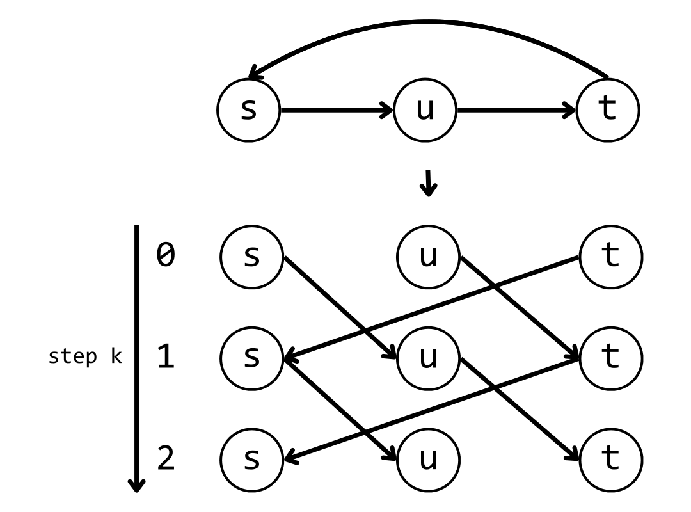

# Basics of Dynamic Programming

## DP Overview
!!! df "**Definition** (Intuitive Definition of Dynamic Programming)"
    _Dynamic programming_ is a combination of recursion and memoization (and _GUESSING_). It is an exhaustive search. One can think of it as a "careful brute-force." There are two uses for dynamic programming:<br>
    &nbsp;&nbsp;&nbsp;&nbsp;1.  Finding an optimal solution: We want a solution to be as large as possible or as small as possible <br>
    &nbsp;&nbsp;&nbsp;&nbsp;2.  Counting the number of solutions: We want to calculate number of all possible solutions

!!! df "**Definition** (Bellman Equation)"
    Bellman Equation is the formula of how subproblems can be used to calculate the main problem. e.g. $f(x) = f(x-1) + f(x-2)$ is a Bellman Equation.

!!! df "**Definition** (Subproblem Dependency DAG)"
    The dependency relation between subproblems form a DAG - _Subproblem Dependency DAG_.  

!!! wr "**Warning** (Limitation of DP)"
    To use memoization, the subproblem dependency graph must be acyclic.      

!!! df "**Definition** (Buttom-Up Implementation)"
    Buttom-up implements a DP algorithm means following topological order of the subproblem dependency DAG to do exact same computation as up-buttom. For example, when calculating the ith term of Fibonacci sequence, recursively call $f(x) = f(x-1) + f(x-2)$ is up-buttom; calculating the first term to the ith term is buttom-up. 
    
!!! st "**Strategy** (Solving DP Problems)"
    &nbsp;&nbsp;&nbsp;&nbsp;1.  Define subproblems -> #subproblems<br>
    &nbsp;&nbsp;&nbsp;&nbsp;2.  Guess (try all possibility after settling something) -> #choices for guess<br>
    &nbsp;&nbsp;&nbsp;&nbsp;3.  Relate subproblem solutions -> time/subproblem (often similar to guess)<br>
    &nbsp;&nbsp;&nbsp;&nbsp;4.  Recurse & memoize (or build DP table bottom-up) -> check if subproblem recurrence is acyclic<br>
    &nbsp;&nbsp;&nbsp;&nbsp;5.  Solve original problem.
    
!!! nt "**Note** (DP Time Complexity)"
    The time Complexity of DP can be calculated by 
    
    $$
    \text{time} = \Theta(\text{#subproblems} \times \text{time per subproblem})
    $$
    
    Note that we treat recursive calls in subproblems as $\Theta(1)$ as they have been memorized!

!!! ex "**Exercise** (Coin Problem)"
    Consider a set of coins of value $\{1, 3, 4\}$. Find the minimum number of coins s.t. the total value is equal to $S$.<br>
    
    ??? sl "**Solution**"
        Note that this problem ask for the "minimum." We think of using DP. Define $f(x)$ be the minimum #coins where the total value equals to $x$. Observe that to find $f(S)$, it suffices to find $\min\{f(S-1), f(S-3), f(S-4)\}$ (We are guessing now). The Bellman Equation of this problem is:
    
        $$
        f(x) = \min\{f(x-1), f(x-3), f(x-4)\} + 1
        $$

        The button-up implementation would be:

        ``` cpp linenums="1"
        f[1]=1, f[2]=2, f[3]=1, f[4]=1; // base case
        for(int i=5;i<=S;i++)
            f[i]=min(min(f[i-1],f[i-3]),f[i-4])+1;
        ```

!!! ex "**Exercise** (Shortest Path: Bellman-Ford)"
    Consider a non-negative weighted directed graph $G = (V, E)$. Find the shortest path between vertex $s$ and vertext  $t$. Note that the graph may contain cycles.

    ??? sl "**Solution**"
        Note that this problem ask for the "minimum." We think of using DP. Define $\mathcal{S}(u,v)$ be the shortest path from $u$ to $v$. A naive way of writing the Bellman Equation is 
        
        $$\begin{align*}
        \mathcal{S}(s,t) = \min_{(u,t)\in E}(\mathcal{S}(s,u) + w_{u,t})
        \end{align*}$$

        So far, by buttom-up implementation, we'll go over all the vertices and edges once. The time complexity is $\Theta(n + m)$. However, this cannot deal with cyclic graph. To find the shortest path in a cyclic graph, we consider convert cyclic $G = (V, E)$ to acyclic $G' = (V', E')$ following "steps": 
        
        <figure markdown="span">
        { width="400" }
        </figure> 

        Define $\mathcal{S}_k(u,v)$ be the shortest path from $u$ to $v$ in $k$ steps. We now come up with a new Bellman Equation:
        
        $$\begin{align*}
        \mathcal{S}_k(s,t) = \min_{(u,t)\in E}(\mathcal{S}_{k-1}(s,u) + w_{u,t})
        \end{align*}$$
        
        Since all edges in $G$ are non-negatively weighted, the maximum steps can take is $n-1$. The #subproblems is now $n^2$ ($k$ can be 0; $k$ has $n$ choices, vertex $t$ has $n$ choices). The time complexity is $\Theta(nm)$ because for each $k$, we go over all edges exactly once.

        The button-up implementation would be:

        ``` cpp linenums="1"
        set all values in s equal to 1e9
        S[0][s] = 0;
        for(int k=1;k<n;k++)
            for(int t=1;t<=n;t++)
                for(all (u,t) in E)
                    S[k][u]=min(S[k][u], S[k-1][u]+w[u][t]);
        ```
!!! im "**Important Note** (Alternative View of DP)"
    For optimization problem, we can view DP as searching for the shortest (longest) path on a DAG.

!!! df "**Definition** (Parent Pointer)"
    The parent pointer is used to record "plan" rather then the "value." It keeps track of how the optimal solution arrives.

!!! ex "**Exercise** (Text Justification)"
    In a text justification problem, define the "badness" of a line starting from ith word and ending in jth word to be: 
    
    $$\begin{align*}
    \text{badness}(i,j) = 
        \begin{cases} 
        {(\text{page width} - \text{words width sum})}^2 \\
        \infty \&nbsp; \text{ if unfit} 
        \end{cases}
    \end{align*}$$

    Find the smallest badness sum of the text. In addition, find all the indexes of words that start a line when the smallest badness sum is achieved.

    ??? sl "**Solution**"
        Define the subproblem `dp[i]` to be the smallest badness sum of the text starting from ith word. This means there are total $n$ subproblems. After setting `i`, we need to **guess** which word to end the line ($\mathcal{O}(n)$). Thus, we have the Bellman equation to be:
        
        $$\begin{align*}
        \text{dp[i]} = \min(\text{dp[j]} + \text{badness}(i,j) \text{ for j in range(i+1, n+1)}) 
        \end{align*}$$

        Check the topological order: the order is $i = n, n-1, n-2, ..., 0$. <br>
        The time complexity is $\mathcal{O}(n^2)$. <br>
        Base Case: `dp[0] = 0` <br>
        The parent point is $\text{parent[i]} = \text{argmin}(...) = j \text{ value}$. <br>
        To print the plan, we access parent pointers this order: 0, parent[0], parent[parent[0]], ...   
        
        
        


        
        
    
    
    
    
