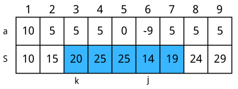

# Basic Data Structure

## Stack
!!! st "**Strategy** (Implementing Stack)"
    For convenience, we can implement a stack using an array:
    
    ``` cpp linenums="1"
    int s[STACK_SIZE]; // using array as a stack
    int p=0; // position

    void push(int x){
        s[++p] = x;
    }

    int pop(){
        if(p==0) cout<<"The stack is empty!";
        return s[p--];
    }
    ```

!!! st "**Strategy** (Opposite Stacks)"
    Putting two stacks on the opposite direction to simulate Editor-like effect.

!!! ex "**Exercise** (In/out Stack)"
    Given $n$ integers $1, 2, \cdots, n$, we want every number to be pushed into an infinite stack once and then popped once. If the in-stack order is $1, 2, \cdots, n$, then how many possible out-stack orders are there?

    ??? sl "**Solution 1** (Iteration)"
        Consider the position of $1$ in the out-stack order. If $1$ is on position $k$, then the process is:
        <br>&nbsp;&nbsp;&nbsp;&nbsp; 1. push $1$ into the stack
        <br>&nbsp;&nbsp;&nbsp;&nbsp; 2. push $2 ~ k$ into the stack and then pop them in some unknown order
        <br>&nbsp;&nbsp;&nbsp;&nbsp; 3. pop $1$
        <br>&nbsp;&nbsp;&nbsp;&nbsp; 4. push $k+1 ~ n$ and then pop them in some unknown order
        Then we get the iterative formula:
        
        $$\begin{align*}
        S_n = \sum^{n}_{k=1}{S_{k-1} * S_{n-k}}
        \end{align*}$$

        The time complexity is $\mathcal{O}(n^2)$.
    
    ??? sl "**Solution 2** (DP)"
        Define $f[i,j]$ be the number of possibility that there are $i$ elements not pushed and $j$ elements left in the stack. Under any situation, there are two choices: push an element or pop an element. The Bellman Equation is:
        
        $$\begin{align*}
        f[i,j] = f[i-1,j+1] + f[i,j-1]
        \end{align*}$$

        The time complexity is $\mathcal{O}(n^2)$.
    
    ??? sl "**Solution 3** (Math)"
        This question is equivalent to calculating the nth Catalan number, i.e. 
        
        $$\begin{align*}
        \frac{C^n_{2n}}{n+1}
        \end{align*}$$

        The time complexity is $\mathcal{O}(n)$.
    
!!! df "**Definition** (Infix, Prefix, Postfix Notation)"
    _Infix Notation_: operators are in-between every pair of operands. e.g. $3 * (1 - 2)$ <br>
    _Prefix Notation_ (Polish Notation): operators are before two expressions. e.g. $* \; 3 - 1 2$ <br>
    _Postfix Notation_ (Reverse Polish Notation): operators are after two expressions. e.g. $1 2 - 3 \; *$

!!! im "**Important Note** (Computing Postfix Expression)"
    Use a stack. Scan the expression following these steps:
    <br>&nbsp;&nbsp;&nbsp;&nbsp; 1. if encounter a number, push it into the stack
    <br>&nbsp;&nbsp;&nbsp;&nbsp; 2. if encounter an operator, pop out two elements from the stack, calculate and push the result into the   stack
    <br> The time complexity is $\mathcal{O}(n)$.

!!! im "**Important Note** (Computing Infix Expression)"
    The fastest way to compute an infix expression is to first turn it into a postfix expression. We can do this following these steps:
    <br>&nbsp;&nbsp;&nbsp;&nbsp; 1. if encounter a number, output it
    <br>&nbsp;&nbsp;&nbsp;&nbsp; 2. if encounter a `(`, push it into the stack
    <br>&nbsp;&nbsp;&nbsp;&nbsp; 3. if encounter a `)`, pop and output elements until we popped a `(`
    <br>&nbsp;&nbsp;&nbsp;&nbsp; 4. if encounter an operator, pop and output elements until the priority of the operator > the element we intend to pop, then push the operator into the stack; The priority ranking is: `*/` > `+-` > `(`.
    <br> <br> After scanning all elements in the expression, we pop all the elements from the stack.

    The key idea here is to use stack to "wait" for `)` if encounter a `(`, or another number if encouter an operator.

## Monotonic Stack

!!! ex "**Exercise** (Largest Rectangle in a Histogram)"
    Find the maximum area of the rectangle that can be outlined in a histogram.

    <figure markdown="span">
    { width="500" }
    </figure>

    ??? sl "**Solution**"
        Consider if the each small rectangle in the histogram is increasing height, then we can simply enumerate heights and ignore all the rectangle on the left for a certain height. When a shorter rectangle comes, we can first view all previous rectangles as increasing height histogram, and then ignore the heights that are larger than the new shorter rectangle. In other word, we are maintaining a _Monotonic Stack_. To implement this, we add a rectangle of height 0 at the end to activate final pop.

        ``` cpp linenums="1"
        a[n+1] = 0; // adding a 0 height rectangle at the end of the histogram
        position = 0; 
        for(int i=1;i<=n;i++){
            if(a[i] > stack[position]){
                // push a rectangle into the stack if the stack is monotonic
                stack[++p] = a[i]; 

                // the width of small rectangle can vary as 
                // it might be the combination of multiple rectangle
                width[position] = 1; 
            }else{
                int width_ = 0;
                while(stack[position] > a[i]){
                    // accumulate width while popping
                    width_ += width[position]; 

                    // calculate the area if using rectangle 'position' as height
                    ans = max(ans, width_ * stack[position]); 
                    p--; // pop
                }

                // push the new rectangle
                stack[++p] = a[i]; 

                // the new rectangle has the accumulated width + 1
                width[position] = width_ + 1; 
            }
        }
        ```

        This is the famous monotonic stack, with time complexity $\mathcal{O}(N)$. The key idea here is to erase impossible choices and maintain the set to be effective and in order.

## Queue
!!! st "**Strategy** (Implementing Queue)"
    For convenience, we can implement a queue using an array. Actually, this is a _deque_. Note that we cannot `push_front` using array. Better try STL `deque`.
    
    ``` cpp linenums="1"
    int q[QUEUE_SIZE]; // using array as a queue
    int l = 1, r = 0; // left index and right index of the queue
    
    void push_end(int x){
        q[++r] = x;
    }

    int pop_front(){
        if(l > r) cout<<"The stack is empty!";
        return q[l++];
    }

    int pop_end(){
        if(l > r) cout<<"The stack is empty!";
        return q[r--];
    }
    ```

## Monotonic Queue
!!! ex "**Exercise** (Maximal Interval Sum)"
    Given a sequence of $n$ integers, find a consecutive interval within length $m$ (at least one) that has the maximal sum. Note that there may be negative numbers. 

    ??? sl "**Solution**"
        We use prefix sum to calculate interval sum. Then, we enumerate right endpoint, which is equivalent to sliding a window of length $m$. Now the tricky part is how to quickly find the left endpoint in that window. <br>
        <br>
        Given a right endpoint $i$, consider two position $j$ and $k$: if $k<j<i$ and $S[k] \ge S[j]$, then **for all right endpoints on the right side of i, k will never be the solution**. This is because $k$ is farther away from $i$ and $k$ is worse than $k$, so $k$ will no longer be a choice for all right endpoitns on the right side of $i$. We can simply maintain a _monotonic queue_ to keep record of current possible choices for left endpoints. We use a deque to store positions, and array `s` to store prefix sum. Detailed steps are:
        <br>&nbsp;&nbsp;&nbsp;&nbsp; 1. if the deque stores elements more than $m$ away from $i$, pop from the **front**
        <br>&nbsp;&nbsp;&nbsp;&nbsp; 2. update answer, `s[i] - s[q[l]]` is the maximal sum when `i` is the right endpoint
        <br>&nbsp;&nbsp;&nbsp;&nbsp; 3. pop the elements from the **end** until the end is less than `s[i]`(maintaining monotonic queue)
        <br>&nbsp;&nbsp;&nbsp;&nbsp; 4. push `i` 

        <figure markdown="span">
        { width="400" }
        </figure>
        
        ``` cpp linenums="1"
        q[l] = 0, r = 1; // save choice j = 0
        for(int i=1;i<=n;i++){
            // clean the outdated choices when we consider i as the right endpoint
            while(l<=r&&q[l]<i-m) l++; 

            // compute the maximum at right endpoint i
            ans = max(ans, s[i] - s[q[l]]); 

            // when i come in, get rid of all useless choices 
            while(l<=r&&s[q[r]]>=s[i]) r--; 

            // i come in
            q[++r] = i; 
        }
        ```

        The order of these operations? The logistic is:
        <br>&nbsp;&nbsp;&nbsp;&nbsp; 1. When we settle a new i, before we update the answer, we must first clean the outdated choices
        <br>&nbsp;&nbsp;&nbsp;&nbsp; 2. We can update our data because the queue is maintained to be monotonic
        <br>&nbsp;&nbsp;&nbsp;&nbsp; 3. After we put i into the queue, we must maintain a monotonic queue

        Note that there should be at least one element in the queue, or we cannot ensure there is at least one element in the queue. Thus, it is vital important to put `q[++r] = i;` at the end of the loop. The right endpoint we are considering at the begining of the loop is $i$, and notice that $i-1$ will always be in the queue as it is push into the queue at last without popping, which guaranteed that we have at least one element in the interval (in the queue).
        
        
    
        
    
    
    
    
    
    
    

        
        
        
        
    
        
        
     

