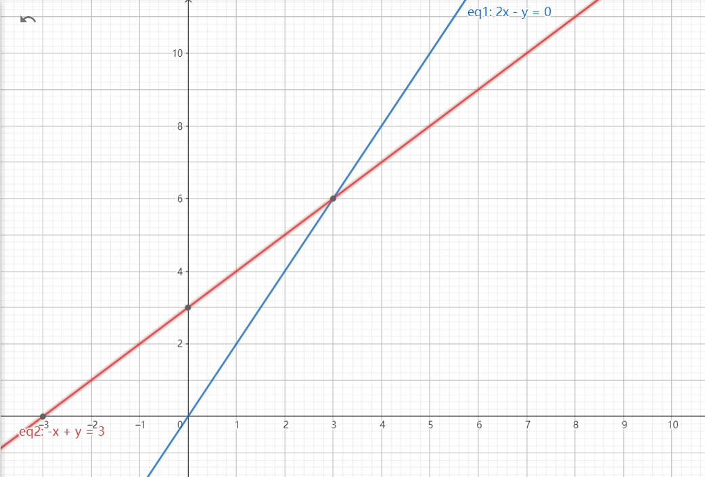
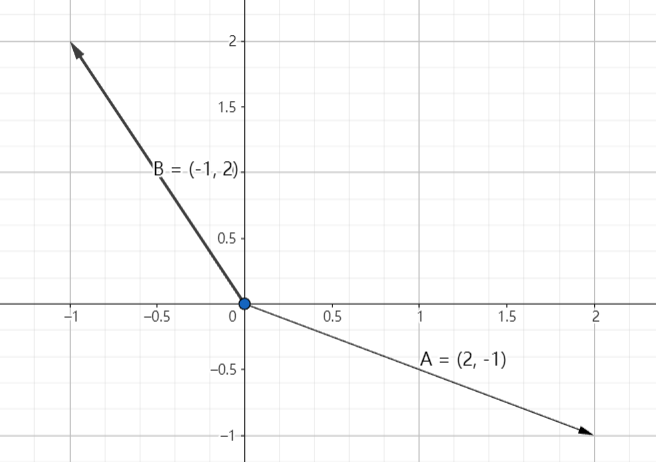

# Starting Point of Linear Algebra

## Geometries of Equations
Essentially, Linear Algebra starts with solving n equations with m variables. To make things easy, we make n equal to m. For example:

$$
2x - y = 0\\
-x + 2y = 3
$$

In the language of Linear Algebra would be:

$$
\begin{bmatrix}
2&-1\\
-1&2
\end{bmatrix}
\begin{bmatrix}
x\\
y
\end{bmatrix}=
\begin{bmatrix}
0\\
3
\end{bmatrix}
$$

Where each of the numbers in the matrix represent a coefficient on the left hand side, and $x$ & $y$ represent the variables.

## Row Picture and Column Picture
If you carefully think about it, there are two ways you can represent the equation with a picture:
First, you can think about it as two lines intersecting each other, with $2x - y = 0$ being the first one, and $-x + 2y = 3$ being the second one:

<figure markdown="span">

<figcaption>Generated Using Geogebra</figcaption>
</figure>

Or you can think about it as a Vector Addition problem:

$$
x\begin{bmatrix}2\\-1\end{bmatrix} + y
\begin{bmatrix}-1\\2\end{bmatrix} = 
\begin{bmatrix}0\\3\end{bmatrix}
$$

Which means that it would become a **Linear Combination**  of the two columns of the coefficient matrix.

<figure markdown="span">

<figcaption>Generated Using Geogebra</figcaption>
</figure>

## Matrix Multiplication
We can think about vectors as matrices with one of the dimensions being 1. 
The following way would be an easy introduction to Matrix Multiplication:

$$
\begin{aligned} &\begin{bmatrix}1\\2\end{bmatrix}\\
\begin{bmatrix}2&-1\\-1&2\end{bmatrix}
&\begin{bmatrix}a_1\\a_2\end{bmatrix}
\end{aligned}
$$

where the vector $\begin{bmatrix}a_1\\a_2\end{bmatrix}$ is the product, and $a_1$ and $a_2$ would be the "inner product" of the row on their left and the column on their top. Therefore:

$$
a_1 = \begin{bmatrix}2&-1\end{bmatrix}\begin{bmatrix}1\\2\end{bmatrix}=2\cdot1 + 2\cdot(-1) = 0\\
a_2 = \begin{bmatrix}-1&2\end{bmatrix}\begin{bmatrix}1\\2\end{bmatrix}=-1\cdot1 + 2\cdot2 = 3
$$

But in fact, there is another more essential way to think about matrix multiplications.

$$
\begin{bmatrix}2&-1\\-1&2\end{bmatrix}\begin{bmatrix}1\\2\end{bmatrix}
$$

can be interpreted as a **Linear Combination of the Columns** of the matrix:

$$
\begin{bmatrix}2&-1\\-1&2\end{bmatrix}\begin{bmatrix}1\\2\end{bmatrix}=
1\begin{bmatrix}2\\-1\end{bmatrix}+2\begin{bmatrix}-1\\2\end{bmatrix}=\begin{bmatrix}0\\3\end{bmatrix}
$$

If you think about this further, you will find that if we multiply a row vector by the matrix, we would essentially get a linear combination of the **Rows** of the matrix:

$$
\begin{aligned}
\begin{bmatrix}1&2\end{bmatrix}\begin{bmatrix}2&-1\\-1&2\end{bmatrix}&=1\begin{bmatrix}2&-1\end{bmatrix}+2\begin{bmatrix}-1&2\end{bmatrix}
\\&=\begin{bmatrix}0&3\end{bmatrix}
\end{aligned}
$$

Such interpretations may seem trivial and cumbersome for now, but in the next chapter we shall see they come into use.